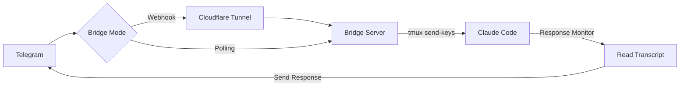

# claudecode-telegram


Telegram bot bridge for Claude Code. Send messages from Telegram, get responses back.

## How it works



1. Bridge receives Telegram messages (webhook or polling mode)
2. Messages are injected into Claude Code via tmux
3. Response monitor detects Claude's replies and sends them back to Telegram
4. Only responds to Telegram-initiated messages (uses pending file as flag)

## Install

```bash
# Prerequisites
brew install tmux cloudflared

# Clone
git clone https://github.com/hanxiao/claudecode-telegram
cd claudecode-telegram

# Setup Python env
uv venv && source .venv/bin/activate
uv pip install -e .
```

## Setup

### 1. Create Telegram bot

Bot receives your messages and sends Claude's responses back.

```bash
# Message @BotFather on Telegram, create bot, get token
```

### 2. Configure Stop hook

Hook triggers when Claude finishes responding, reads transcript, sends to Telegram.

```bash
cp hooks/send-to-telegram.sh ~/.claude/hooks/
nano ~/.claude/hooks/send-to-telegram.sh  # set your bot token
chmod +x ~/.claude/hooks/send-to-telegram.sh
```

Add to `~/.claude/settings.json`:

```json
{
  "hooks": {
    "Stop": [{"hooks": [{"type": "command", "command": "~/.claude/hooks/send-to-telegram.sh"}]}]
  }
}
```

### 3. Start tmux + Claude

tmux keeps Claude Code running persistently; bridge injects messages via `send-keys`.

```bash
tmux new -s claude
claude --dangerously-skip-permissions
```

### 4. Run bridge

Bridge receives Telegram messages and injects them into Claude Code.

**Webhook mode** (default): Uses HTTP webhooks via Cloudflare tunnel
```bash
export TELEGRAM_BOT_TOKEN="your_token"
python bridge.py --mode webhook
# or simply: python bridge.py
```

**Polling mode**: Direct polling of Telegram API (no tunnel needed)
```bash
export TELEGRAM_BOT_TOKEN="your_token"
python bridge.py --mode polling
```

Both modes support all features including callbacks and real-time response capture.

### 5. Expose via Cloudflare Tunnel

Tunnel exposes local bridge to the internet so Telegram can reach it.

```bash
cloudflared tunnel --url http://localhost:8081
```

**Note**: Polling mode does not require a tunnel. Skip steps 5 and 6 if using polling mode.

### 6. Set webhook

Tells Telegram where to send message updates.

```bash
curl "https://api.telegram.org/bot${TELEGRAM_BOT_TOKEN}/setWebhook?url=https://YOUR-TUNNEL-URL.trycloudflare.com"
```

## Bridge Modes

### Webhook Mode (Default)

Pros:
- Real-time message delivery
- Efficient (no polling overhead)

Cons:
- Requires Cloudflare tunnel or public URL
- More complex setup

### Polling Mode

Pros:
- No tunnel required
- Simpler setup
- Works behind firewalls/NAT

Cons:
- Slight delay (up to 30 seconds) receiving messages
- Uses more bandwidth

## Bot Commands

| Command            | Description                              |
| ------------------ | ---------------------------------------- |
| `/status`        | Check tmux session                       |
| `/clear`         | Clear conversation                       |
| `/resume`        | Pick session to resume (inline keyboard) |
| `/continue_`     | Auto-continue most recent                |
| `/loop <prompt>` | Start Ralph Loop (5 iterations)          |
| `/stop`          | Interrupt Claude                         |

All commands work in both webhook and polling modes.

## Environment Variables

| Variable               | Default    | Description              |
| ---------------------- | ---------- | ------------------------ |
| `TELEGRAM_BOT_TOKEN` | required   | Bot token from BotFather |
| `TMUX_SESSION`       | `claude` | tmux session name        |
| `PORT`               | `8081`   | Bridge port (webhook)    |
| `BRIDGE_MODE`        | `webhook`| Default mode if --mode not set |

## Architecture

The bridge consists of several key components:

1. **BaseMessageHandler**: Common message processing logic for both modes
2. **WebhookHandler**: HTTP server for webhook mode
3. **PollingHandler**: Direct polling of Telegram API
4. **ResponseMonitor**: Real-time detection of Claude's responses

### Response Monitor

The Response Monitor is a new feature that actively monitors Claude's transcript files for assistant responses and sends them back to Telegram. This ensures:

- **Real-time responses**: No more waiting for the Stop hook
- **Works in both modes**: Webhook and polling modes
- **Reliable delivery**: Retries and error handling
- **Cleanup**: Automatically removes pending flag after response

### Callback Support

Both modes support inline keyboard callbacks (used by `/resume` command):
- Resume specific session
- Continue most recent session
- Full error handling and retry logic

## Troubleshooting

### Webhook mode not receiving messages

1. Check Cloudflare tunnel is running
2. Verify webhook URL is set correctly:
   `curl "https://api.telegram.org/bot${TELEGRAM_BOT_TOKEN}/getWebhookInfo"`
3. Check bridge logs for errors

### Polling mode not receiving messages

1. Check bot token is set: `echo $TELEGRAM_BOT_TOKEN`
2. Verify bridge is running and connected
3. Check for API errors in logs

### No responses from Claude

1. Verify tmux session exists: `tmux ls`
2. Check Claude is running in tmux
3. Verify ResponseMonitor is active (should see "Response monitor started")
4. Check transcript directory has write permissions

### Multiple/duplicate responses

1. Check only one bridge instance is running
2. Clear pending file: `rm -f ~/.claude/telegram_pending`
3. Restart bridge

## 常见命令
    tmux a -t claude
    claude --dangerously-skip-permissions
    tmux kill-session -t claude
